# Document Translation AI Pipeline - Investigation Report

## Implementation Status (December 2025)

This project has been **fully implemented** based on the investigation findings below. Key features:

| Feature | Status | Notes |
|---------|--------|-------|
| OCR Pipeline | ✅ Complete | olmOCR-2 via DeepInfra |
| Document Scanner | ✅ Complete | Recursive PDF scanning |
| DuckDB Storage | ✅ Complete | Pages, terminology, checkpoints |
| Terminology Extraction | ✅ Complete | Frequency-based extraction |
| LangGraph Pipeline | ✅ Complete | Stateful workflow with checkpoints |
| Translation | ✅ Complete | OpenRouter with Claude 3.5 Sonnet |
| RTL/LTR Tables | ✅ Complete | Auto-reversal at translation + export |
| Export (MD/PDF/DOCX) | ✅ Complete | All formats supported |
| CLI Interface | ✅ Complete | Rich progress bars, status |
| Config (YAML) | ✅ Complete | Full configuration support |

### What Was Implemented vs Investigation Plan

**Implemented as planned:**
- olmOCR-2 as primary OCR (DeepSeek-OCR removed - olmOCR performed better for Arabic)
- DuckDB with separate language columns (ar_content, en_content, fr_content)
- LangGraph for pipeline orchestration
- OpenRouter for translation
- YAML configuration with environment variable support

**Additional features added:**
- RTL to LTR table column reversal (automatic)
- HTML table to Markdown conversion
- Rich CLI with progress tracking
- Multi-format export (MD, PDF, DOCX)
- Simple `run` command for one-step execution

**Not yet implemented (available infrastructure exists):**
- DuckDB FTS indexes (code exists, not called in pipeline)
- DuckDB VSS vector indexes (code exists, not called in pipeline)
- Embedding generation for terminology (code exists, not used)
- RAG-based term suggestions (code exists, not integrated)

---

## Original Investigation

User Prompt:
this is a blank directory to start new project using uv python 3.14 package manager using latest packages and modern python to create a new python package to use latest new deepseek-ocr models (using 3rd party https://deepinfra.com/deepseek-ai/DeepSeek-OCR or https://deepinfra.com/allenai/olmOCR-2-7B-1025 do the needed investigation to use them in an optmized way) as well as taking Openrouter api key to do the following ..
it will tak an input as a directory with a lot of subdirectories with pdfs/docx/md..etc
it will go throw them and save the current state check point with this catalog hirarichy and start using the smart ocr page by page or whatever to have the digitizing data from those pdfs with taking binfits from deepseek-ocr or olmocr latest to detect tables as well as infos from digrams .. and output of it as a first stage will be markdow files .. i don't know how to keep the pages numbers related with / binded with original but it can be also a duckdb table that has all the happenning progress including the document name and full path and relative path and original_content with page by page like page_number coulmn or something like this .. and then we will create a very simple RAG/AI-AGENT/Langchain or Langgraph or whatever the best for this job to translate thoses pages but in the following ! we can use https://raw.githubusercontent.com/duckdb/duckdb-web/refs/heads/main/docs/stable/core_extensions/vss.md and https://raw.githubusercontent.com/duckdb/duckdb-web/refs/heads/main/docs/stable/guides/sql_features/full_text_search.md to search for the common termonologies in the same pdf and extract them in new table in duckdb .. and it should be related with the table .. and then it will connect in an efficint way to LLM from openrouter to do a translation for theose termonologyes in for the next stage
the next stage will be go page by page understanding the prev page and next page so brefily and token optmized way for understanding the context to translate it in very effecting way .. and first we want to have the systme prompt for ay to be also customized for each document for the best translation possible ... and then the final output can be first other coulmn in duckdb with ar_content or en_content or fr_content depends on the needed language and the same hiricy directory with the original pdf but with the translated final md files ? everything should be configruable from something like yaml file including the tokens directories .. etc .. you can suggest better approach or learn/suggest similar projects ? do the needed investigation first with a final md file with your results

## Executive Summary

This report investigates the optimal architecture for building a Python-based document translation pipeline that:

1. Digitizes documents (PDF/DOCX/MD) using modern OCR models
2. Extracts and manages terminology
3. Translates content page-by-page with context awareness
4. Outputs translated markdown files maintaining original hierarchy

---

## 1. OCR Models Investigation

### 1.1 DeepSeek-OCR (via DeepInfra)

**Overview:**

- Released October 2025 by DeepSeek AI
- Frontier OCR model for optical context compression
- Architecture: DeepEncoder + DeepSeek3B-MoE-A570M decoder
- Achieves 97% OCR precision when text tokens < 10x vision tokens

**API Access (DeepInfra):**

```python
# OpenAI-compatible API
import openai

client = openai.OpenAI(
    base_url="https://api.deepinfra.com/v1/openai",
    api_key="YOUR_DEEPINFRA_TOKEN"
)

response = client.chat.completions.create(
    model="deepseek-ai/DeepSeek-OCR",
    messages=[{
        "role": "user",
        "content": [
            {"type": "image_url", "image_url": {"url": f"data:image/png;base64,{base64_image}"}},
            {"type": "text", "text": "<image>\nConvert the document to markdown."}
        ]
    }]
)
```

**Strengths:**

- Excellent at complex document layouts
- Native markdown output
- Table detection capabilities
- Diagram/chart understanding

**Limitations:**

- Requires image input (must convert PDF pages to images)
- API costs at DeepInfra

---

### 1.2 olmOCR-2-7B (via DeepInfra)

**Overview:**

- Developed by Allen AI
- Based on Qwen2-VL-7B-Instruct, fine-tuned on ~250k diverse PDF pages
- Latest version: v0.4.0 (October 2025) with RL training improvements
- Cost-effective: ~$190 USD per million PDF pages

**API Access (DeepInfra):**

```python
# Model: allenai/olmOCR-2-7B-1025
response = client.chat.completions.create(
    model="allenai/olmOCR-2-7B-1025",
    messages=[{
        "role": "user",
        "content": [
            {"type": "image_url", "image_url": {"url": f"data:image/png;base64,{image_base64}"}},
            {"type": "text", "text": build_ocr_prompt()}
        ]
    }]
)
```

**Strengths:**

- Excellent reading order preservation
- Strong table/equation/handwriting support
- FP8 version runs faster with fewer retries
- Handles complex layouts and poor-quality scans
- Native markdown output with `--markdown` flag

**Limitations:**

- GPU required for local inference (RTX 4090, L40S, A100, H100 recommended)
- 20GB GPU RAM needed locally

---

### 1.3 Recommendation: Hybrid Approach

| Document Type           | Recommended OCR                |
| ----------------------- | ------------------------------ |
| Complex tables/diagrams | DeepSeek-OCR                   |
| Standard documents      | olmOCR-2 (more cost-effective) |
| Scientific papers       | olmOCR-2 (trained on papers)   |
| Handwritten content     | olmOCR-2                       |

**Implementation Strategy:**

1. Use `pymupdf4llm` for initial text extraction (native PDFs)
2. Fall back to olmOCR-2 via DeepInfra for scanned/image PDFs
3. Use DeepSeek-OCR for complex diagrams/tables when olmOCR struggles

---

## 2. PDF/Document Processing Libraries

### 2.1 PyMuPDF4LLM (Recommended for Native PDFs)

**Performance:** 0.12s processing time - fastest option
**Features:**

- GitHub-compatible markdown output
- Table detection
- Header/bold/italic detection
- Page-by-page chunking
- Image extraction

```python
import pymupdf4llm

# Page-by-page extraction with metadata
pages = pymupdf4llm.to_markdown("input.pdf", page_chunks=True)
# pages[0] = {'text': '...', 'metadata': {...}}
```

### 2.2 Docling (IBM) - Best for Complex Tables

**Accuracy:** 97.9% on complex table extraction (2025 benchmark winner)
**Features:**

- TableFormer AI for table structure
- Layout detection model
- Export to Pandas DataFrames
- LangChain/LlamaIndex integration

```python
from docling.document_converter import DocumentConverter

converter = DocumentConverter()
result = converter.convert("document.pdf")
for table in result.document.tables:
    df = table.export_to_dataframe()
```

### 2.3 marker-pdf

**Performance:** 11.3s - slower but perfect structure preservation
**Best for:** High-quality conversions where accuracy > speed

### 2.4 PDF to Image Conversion (for OCR APIs)

```python
import fitz  # PyMuPDF
import base64

def pdf_page_to_base64(pdf_path: str, page_num: int) -> str:
    doc = fitz.open(pdf_path)
    page = doc[page_num]
    pix = page.get_pixmap(dpi=150)
    img_bytes = pix.tobytes("png")
    return base64.b64encode(img_bytes).decode()
```

---

## 3. DuckDB for Data Management

### 3.1 Schema Design

```sql
-- Main documents table
CREATE TABLE documents (
    id INTEGER PRIMARY KEY,
    file_name VARCHAR NOT NULL,
    full_path VARCHAR NOT NULL,
    relative_path VARCHAR NOT NULL,
    file_type VARCHAR,
    total_pages INTEGER,
    status VARCHAR DEFAULT 'pending',
    created_at TIMESTAMP DEFAULT CURRENT_TIMESTAMP,
    updated_at TIMESTAMP
);

-- Page-level content table
CREATE TABLE pages (
    id INTEGER PRIMARY KEY,
    document_id INTEGER REFERENCES documents(id),
    page_number INTEGER NOT NULL,
    original_content TEXT,
    ar_content TEXT,
    en_content TEXT,
    fr_content TEXT,
    embedding FLOAT[1536],  -- for VSS
    ocr_model VARCHAR,
    ocr_confidence FLOAT,
    created_at TIMESTAMP DEFAULT CURRENT_TIMESTAMP
);

-- Terminology extraction table
CREATE TABLE terminology (
    id INTEGER PRIMARY KEY,
    document_id INTEGER REFERENCES documents(id),
    term VARCHAR NOT NULL,
    frequency INTEGER,
    translation_ar VARCHAR,
    translation_en VARCHAR,
    translation_fr VARCHAR,
    context TEXT,
    embedding FLOAT[1536]
);

-- Processing checkpoints
CREATE TABLE checkpoints (
    id INTEGER PRIMARY KEY,
    document_id INTEGER REFERENCES documents(id),
    stage VARCHAR NOT NULL,  -- 'ocr', 'terminology', 'translation'
    last_page INTEGER,
    status VARCHAR,
    error_message TEXT,
    updated_at TIMESTAMP DEFAULT CURRENT_TIMESTAMP
);
```

### 3.2 Vector Similarity Search (VSS)

```sql
INSTALL vss;
LOAD vss;

-- Create HNSW index for semantic search
CREATE INDEX terminology_embedding_idx
ON terminology
USING HNSW (embedding)
WITH (metric = 'cosine');

-- Find similar terms
SELECT term, translation_ar,
       array_cosine_distance(embedding, ?::FLOAT[1536]) as distance
FROM terminology
ORDER BY distance
LIMIT 10;
```

### 3.3 Full-Text Search (FTS)

```sql
-- Install FTS extension
INSTALL fts;
LOAD fts;

-- Create FTS index on pages
PRAGMA create_fts_index('pages', 'id', 'original_content');

-- Search for terminology
SELECT fts_main_pages.match_bm25(id, 'technical term') AS score,
       page_number, original_content
FROM pages
WHERE score IS NOT NULL
ORDER BY score DESC;
```

---

## 4. RAG Framework Comparison

### 4.1 Benchmark Results (2025)

| Framework  | Overhead (ms) | Token Usage | Best For          |
| ---------- | ------------- | ----------- | ----------------- |
| DSPy       | 3.53          | ~2.03k      | Optimization      |
| Haystack   | 5.9           | ~1.57k      | Production        |
| LlamaIndex | 6.0           | ~1.60k      | Document indexing |
| LangChain  | 10.0          | ~2.40k      | Prototyping       |
| LangGraph  | 14.0          | ~2.03k      | Complex workflows |

### 4.2 Recommendation: LangGraph

**Why LangGraph for this project:**

1. **Stateful processing** - Critical for page-by-page translation with context
2. **Checkpointing** - Built-in persistence for resume capability
3. **Human-in-the-loop** - Can pause for terminology review
4. **Multi-agent support** - Separate agents for OCR, terminology, translation

```python
from langgraph.graph import StateGraph
from langgraph.checkpoint.sqlite import SqliteSaver

# Define state
class TranslationState(TypedDict):
    document_path: str
    current_page: int
    pages: list[dict]
    terminology: dict
    translations: list[str]

# Create graph
workflow = StateGraph(TranslationState)
workflow.add_node("extract_page", extract_page_node)
workflow.add_node("extract_terminology", terminology_node)
workflow.add_node("translate", translation_node)

# Add checkpointing
memory = SqliteSaver.from_conn_string("checkpoints.db")
app = workflow.compile(checkpointer=memory)
```

---

## 5. Similar Projects Analysis

### 5.1 PDFMathTranslate (EMNLP 2025)

- **GitHub:** https://github.com/PDFMathTranslate/PDFMathTranslate
- **Features:** Preserves formulas, charts, TOC, annotations
- **Translation Services:** Google, DeepL, Ollama, OpenAI
- **Learnings:** Layout preservation is critical

### 5.2 BabelDOC

- **GitHub:** https://github.com/funstory-ai/BabelDOC
- **Features:** Python API for document translation
- **Learnings:** Embeddable library design

### 5.3 OpenAI-Translator

- **GitHub:** https://github.com/DjangoPeng/openai-translator
- **Features:** Modular OOP design, multiple LLM support
- **Learnings:** Flexible architecture

### 5.4 Docling

- **GitHub:** https://github.com/docling-project/docling
- **Features:** IBM's document converter, excellent table detection
- **Integration:** LangChain, LlamaIndex, Haystack

---

## 6. OpenRouter Integration

### 6.1 Best Models for Translation (2025)

| Model            | Strengths                       | Cost Tier |
| ---------------- | ------------------------------- | --------- |
| Llama 3.3 70B    | Best open model for translation | Medium    |
| GPT-4o           | Excellent quality               | High      |
| Gemini 2.5 Flash | Fast, multilingual              | Low       |
| Claude Sonnet 4  | Nuanced translation             | Medium    |
| DeepSeek V3      | Cost-effective                  | Low       |

### 6.2 Python Integration

```python
from openai import OpenAI

client = OpenAI(
    base_url="https://openrouter.ai/api/v1",
    api_key="YOUR_OPENROUTER_KEY"
)

# Auto-routing to best model
response = client.chat.completions.create(
    model="openrouter/auto",  # Or specific model
    messages=[
        {"role": "system", "content": system_prompt},
        {"role": "user", "content": translation_prompt}
    ]
)
```

---

## 7. Proposed Architecture

### 7.1 High-Level Pipeline (Mermaid)

```mermaid
flowchart TB
    subgraph Config["⚙️ Configuration"]
        YAML[config.yaml]
        ENV[Environment Variables]
    end

    subgraph Scanner["📂 Document Scanner"]
        SCAN[Recursive Directory Scan]
        DETECT[File Type Detection]
        CATALOG[Build Catalog in DuckDB]
    end

    subgraph OCR["🔍 OCR Pipeline"]
        PYMUPDF[PyMuPDF4LLM<br/>Native PDFs]
        OLMOCR[olmOCR-2<br/>Scanned PDFs]
        DEEPSEEK[DeepSeek-OCR<br/>Complex Layouts]
        PAGES_DB[(DuckDB<br/>pages table)]
    end

    subgraph Terminology["📚 Terminology"]
        FTS[Full-Text Search<br/>Keyword Extraction]
        EMBED[Generate Embeddings]
        VSS[Vector Similarity<br/>Clustering]
        TERMS_DB[(DuckDB<br/>terminology table)]
    end

    subgraph Translation["🌍 Translation"]
        CONTEXT[Build Context<br/>prev/next page]
        LLM[OpenRouter LLM]
        VALIDATE[Validate & Store]
    end

    subgraph Output["📤 Output"]
        MD[Markdown Files]
        REPORT[Translation Report]
        HIERARCHY[Original Hierarchy]
    end

    Config --> Scanner
    SCAN --> DETECT --> CATALOG

    Scanner --> OCR
    PYMUPDF --> PAGES_DB
    OLMOCR --> PAGES_DB
    DEEPSEEK --> PAGES_DB

    OCR --> Terminology
    FTS --> EMBED --> VSS --> TERMS_DB

    Terminology --> Translation
    CONTEXT --> LLM --> VALIDATE

    Translation --> Output
    VALIDATE --> MD
    VALIDATE --> REPORT
    MD --> HIERARCHY
```



### 7.2 OCR Model Selection Flow


### 7.3 Detailed Architecture Diagram

```
┌─────────────────────────────────────────────────────────────────┐
│                        CONFIG (YAML)                            │
│  - Input/Output directories                                     │
│  - API keys (DeepInfra, OpenRouter)                            │
│  - Target language                                              │
│  - Model preferences                                            │
│  - Processing mode: auto | semi-auto                           │
└─────────────────────────────────────────────────────────────────┘
                              │
                              ▼
┌─────────────────────────────────────────────────────────────────┐
│                    DOCUMENT SCANNER                             │
│  - Recursively scan input directory                            │
│  - Detect file types (PDF, DOCX, MD)                           │
│  - Build catalog in DuckDB                                     │
│  - Create checkpoints                                           │
└─────────────────────────────────────────────────────────────────┘
                              │
                              ▼
┌─────────────────────────────────────────────────────────────────┐
│                      OCR PIPELINE                               │
│  ┌──────────────┐  ┌──────────────┐  ┌──────────────┐         │
│  │ PyMuPDF4LLM  │→│  olmOCR-2    │→│ DeepSeek-OCR │         │
│  │ (Native PDF) │  │ (Scanned)    │  │ (Complex)    │         │
│  └──────────────┘  └──────────────┘  └──────────────┘         │
│                          │                                      │
│                          ▼                                      │
│              Store in DuckDB (pages table)                     │
│              Save checkpoint per page                           │
└─────────────────────────────────────────────────────────────────┘
                              │
                              ▼
┌─────────────────────────────────────────────────────────────────┐
│                 TERMINOLOGY EXTRACTION                          │
│  - DuckDB FTS for keyword frequency                            │
│  - Embedding generation (sentence-transformers)                │
│  - DuckDB VSS for semantic clustering                          │
│  - Store in terminology table                                   │
└─────────────────────────────────────────────────────────────────┘
                              │
                              ▼
┌─────────────────────────────────────────────────────────────────┐
│              TERMINOLOGY TRANSLATION                            │
│  - Batch translate terms via OpenRouter                        │
│  - Human review option (LangGraph pause)                       │
│  - Store translations in DuckDB                                │
└─────────────────────────────────────────────────────────────────┘
                              │
                              ▼
┌─────────────────────────────────────────────────────────────────┐
│                 PAGE TRANSLATION (LangGraph)                    │
│  ┌────────────────────────────────────────────────────────┐    │
│  │                   TranslationState                      │    │
│  │  - Current page content                                 │    │
│  │  - Previous page summary (context)                      │    │
│  │  - Next page preview (context)                          │    │
│  │  - Terminology glossary                                 │    │
│  │  - Document-specific system prompt                      │    │
│  └────────────────────────────────────────────────────────┘    │
│                          │                                      │
│                          ▼                                      │
│  ┌─────────────┐  ┌──────────────┐  ┌──────────────────┐      │
│  │ Build       │→│ Translate    │→│ Validate &       │      │
│  │ Context     │  │ via LLM      │  │ Store            │      │
│  └─────────────┘  └──────────────┘  └──────────────────┘      │
└─────────────────────────────────────────────────────────────────┘
                              │
                              ▼
┌─────────────────────────────────────────────────────────────────┐
│                      OUTPUT GENERATOR                           │
│  - Export translated pages to markdown                         │
│  - Maintain original directory hierarchy                       │
│  - Generate translation report                                  │
└─────────────────────────────────────────────────────────────────┘
```

---

## 8. Processing Modes: Automatic vs Semi-Automatic

The system supports two processing modes to accommodate different workflows:

### 8.1 Mode Comparison

| Feature            | Automatic Mode                   | Semi-Automatic Mode        |
| ------------------ | -------------------------------- | -------------------------- |
| User Interaction   | None required                    | Review at checkpoints      |
| Terminology Review | Auto-approved                    | Manual review & edit       |
| Translation Review | Auto-approved                    | Optional page review       |
| Best For           | Batch processing, overnight runs | Quality-critical documents |
| Speed              | Fastest                          | Depends on review time     |

### 8.2 Mode Flow Diagram (Mermaid)


### 8.3 Configuration

```yaml
# config.yaml
processing:
  # Mode: "auto" or "semi-auto"
  mode: "semi-auto"

  # Semi-auto specific settings
  semi_auto:
    # Pause for terminology review after extraction
    review_terminology: true

    # Pause for terminology translation review
    review_term_translations: true

    # Enable page-by-page translation review (slower)
    review_page_translations: false

    # Export terminology to CSV for external review
    export_terminology_csv: true
    terminology_csv_path: "./review/terminology.csv"

    # Import reviewed terminology from CSV
    import_reviewed_terminology: true
    reviewed_terminology_path: "./review/terminology_reviewed.csv"

    # Timeout for review prompts (seconds, 0 = no timeout)
    review_timeout: 0

  # Auto mode specific settings
  auto:
    # Continue on non-critical errors
    continue_on_error: true

    # Auto-approve low-confidence translations
    auto_approve_confidence_threshold: 0.8
```

### 8.4 Semi-Auto Mode Implementation

```python
from enum import Enum
from typing import Optional
import csv
from pathlib import Path

class ReviewPoint(Enum):
    TERMINOLOGY_EXTRACTION = "terminology_extraction"
    TERMINOLOGY_TRANSLATION = "terminology_translation"
    PAGE_TRANSLATION = "page_translation"

class ReviewManager:
    """Manage human review checkpoints in semi-auto mode."""

    def __init__(self, config: dict, console: Console):
        self.config = config
        self.console = console
        self.mode = config.get("processing", {}).get("mode", "auto")

    def should_review(self, review_point: ReviewPoint) -> bool:
        """Check if review is needed at this point."""
        if self.mode == "auto":
            return False

        semi_auto_config = self.config.get("processing", {}).get("semi_auto", {})
        mapping = {
            ReviewPoint.TERMINOLOGY_EXTRACTION: "review_terminology",
            ReviewPoint.TERMINOLOGY_TRANSLATION: "review_term_translations",
            ReviewPoint.PAGE_TRANSLATION: "review_page_translations",
        }
        return semi_auto_config.get(mapping[review_point], False)

    def export_for_review(
        self,
        terms: list[dict],
        output_path: Path
    ) -> None:
        """Export terminology to CSV for external review."""
        output_path.parent.mkdir(parents=True, exist_ok=True)

        with open(output_path, "w", newline="", encoding="utf-8") as f:
            writer = csv.DictWriter(f, fieldnames=[
                "term", "frequency", "context",
                "translation_ar", "translation_en", "translation_fr",
                "approved", "notes"
            ])
            writer.writeheader()
            for term in terms:
                writer.writerow({
                    **term,
                    "approved": "",
                    "notes": ""
                })

        self.console.print(f"[green]Terminology exported to {output_path}[/green]")
        self.console.print("[yellow]Please review and edit the CSV file.[/yellow]")
        self.console.print("[yellow]Set 'approved' to 'yes' for each term when done.[/yellow]")

    def import_reviewed(self, input_path: Path) -> list[dict]:
        """Import reviewed terminology from CSV."""
        reviewed = []
        with open(input_path, "r", encoding="utf-8") as f:
            reader = csv.DictReader(f)
            for row in reader:
                if row.get("approved", "").lower() in ("yes", "y", "true", "1"):
                    reviewed.append(row)
        return reviewed

    def interactive_review(
        self,
        items: list[dict],
        item_type: str = "term"
    ) -> list[dict]:
        """Interactive CLI review of items."""
        from rich.table import Table
        from rich.prompt import Prompt, Confirm

        self.console.print(f"\n[bold]Review {len(items)} {item_type}s[/bold]\n")

        reviewed = []
        for i, item in enumerate(items, 1):
            # Display item
            table = Table(title=f"{item_type.title()} {i}/{len(items)}")
            for key, value in item.items():
                table.add_row(str(key), str(value))
            self.console.print(table)

            # Get user input
            action = Prompt.ask(
                "Action",
                choices=["approve", "edit", "skip", "quit"],
                default="approve"
            )

            if action == "approve":
                reviewed.append(item)
            elif action == "edit":
                edited = self._edit_item(item)
                reviewed.append(edited)
            elif action == "skip":
                continue
            elif action == "quit":
                if Confirm.ask("Save progress and exit?"):
                    break

        return reviewed

    def _edit_item(self, item: dict) -> dict:
        """Edit a single item interactively."""
        from rich.prompt import Prompt

        edited = item.copy()
        self.console.print("[dim]Press Enter to keep current value[/dim]")

        for key in ["translation_ar", "translation_en", "translation_fr"]:
            if key in edited:
                current = edited.get(key, "")
                new_value = Prompt.ask(f"{key}", default=current)
                edited[key] = new_value

        return edited

    async def wait_for_review(self, review_point: ReviewPoint) -> bool:
        """
        Pause execution and wait for user to complete review.
        Returns True if review completed, False if cancelled.
        """
        from rich.prompt import Confirm

        self.console.print(f"\n[bold yellow]⏸️  REVIEW CHECKPOINT: {review_point.value}[/bold yellow]")
        self.console.print("Processing paused for human review.\n")

        if review_point == ReviewPoint.TERMINOLOGY_EXTRACTION:
            self.console.print("Options:")
            self.console.print("  1. Review terminology in exported CSV")
            self.console.print("  2. Use interactive CLI review")
            self.console.print("  3. Skip review and continue")

        return Confirm.ask("Continue processing?", default=True)
```

### 8.5 LangGraph Integration for Semi-Auto Mode

```python
from langgraph.graph import StateGraph, END
from langgraph.checkpoint.sqlite import SqliteSaver
from typing import TypedDict, Literal

class TranslationState(TypedDict):
    document_id: int
    current_stage: str
    terminology: list[dict]
    reviewed_terminology: list[dict]
    pages: list[dict]
    translations: list[str]
    mode: Literal["auto", "semi-auto"]
    awaiting_review: bool
    review_type: str | None

def create_translation_graph(config: dict):
    """Create LangGraph workflow with review checkpoints."""

    workflow = StateGraph(TranslationState)

    # Add nodes
    workflow.add_node("scan", scan_documents)
    workflow.add_node("ocr", process_ocr)
    workflow.add_node("extract_terms", extract_terminology)
    workflow.add_node("review_terms", review_terminology_node)
    workflow.add_node("translate_terms", translate_terminology)
    workflow.add_node("review_term_trans", review_term_translations_node)
    workflow.add_node("translate_pages", translate_pages)
    workflow.add_node("export", export_results)

    # Define edges with conditional routing
    workflow.set_entry_point("scan")
    workflow.add_edge("scan", "ocr")
    workflow.add_edge("ocr", "extract_terms")

    # Conditional: review terminology or continue
    workflow.add_conditional_edges(
        "extract_terms",
        should_review_terms,
        {
            "review": "review_terms",
            "continue": "translate_terms"
        }
    )

    workflow.add_edge("review_terms", "translate_terms")

    # Conditional: review term translations or continue
    workflow.add_conditional_edges(
        "translate_terms",
        should_review_term_translations,
        {
            "review": "review_term_trans",
            "continue": "translate_pages"
        }
    )

    workflow.add_edge("review_term_trans", "translate_pages")
    workflow.add_edge("translate_pages", "export")
    workflow.add_edge("export", END)

    # Add checkpointing for resume capability
    memory = SqliteSaver.from_conn_string("checkpoints.db")

    return workflow.compile(
        checkpointer=memory,
        interrupt_before=["review_terms", "review_term_trans"]  # Pause points
    )

def should_review_terms(state: TranslationState) -> str:
    """Decide whether to review terminology."""
    if state["mode"] == "semi-auto" and state.get("awaiting_review"):
        return "review"
    return "continue"

def should_review_term_translations(state: TranslationState) -> str:
    """Decide whether to review term translations."""
    if state["mode"] == "semi-auto" and state.get("awaiting_review"):
        return "review"
    return "continue"

async def review_terminology_node(state: TranslationState) -> TranslationState:
    """Node that handles terminology review."""
    # This node will be interrupted before execution
    # When resumed, it processes the reviewed data

    # Check if review data was provided
    if "reviewed_terminology" in state and state["reviewed_terminology"]:
        # User has provided reviewed terminology
        state["terminology"] = state["reviewed_terminology"]
        state["awaiting_review"] = False
        return state

    # Mark as awaiting review (will interrupt)
    state["awaiting_review"] = True
    state["review_type"] = "terminology"
    return state
```

### 8.6 CLI Commands for Semi-Auto Mode

```python
@app.command()
def run(
    config_path: str = "config.yaml",
    mode: str = typer.Option(None, help="Override mode: auto or semi-auto")
):
    """Run the translation pipeline."""
    config = load_config(config_path)

    if mode:
        config["processing"]["mode"] = mode

    console.print(f"[bold]Running in {config['processing']['mode']} mode[/bold]")

    graph = create_translation_graph(config)

    # Run the graph
    result = graph.invoke(initial_state)

    # If interrupted for review, save state
    if result.get("awaiting_review"):
        console.print("\n[yellow]Pipeline paused for review.[/yellow]")
        console.print("Run 'translate-docs resume' after completing review.")

@app.command()
def review(
    db_path: str = "data/translation.duckdb",
    review_type: str = typer.Option("terminology", help="What to review: terminology, translations")
):
    """Interactive review of terminology or translations."""
    manager = ReviewManager(load_config(), Console())

    if review_type == "terminology":
        terms = load_pending_terms(db_path)
        reviewed = manager.interactive_review(terms, "term")
        save_reviewed_terms(db_path, reviewed)
        console.print(f"[green]Reviewed {len(reviewed)} terms[/green]")

@app.command()
def export_review(
    db_path: str = "data/translation.duckdb",
    output: str = "review/terminology.csv"
):
    """Export terminology to CSV for external review."""
    terms = load_pending_terms(db_path)
    manager = ReviewManager(load_config(), Console())
    manager.export_for_review(terms, Path(output))

@app.command()
def import_review(
    input_path: str = "review/terminology_reviewed.csv",
    db_path: str = "data/translation.duckdb"
):
    """Import reviewed terminology from CSV."""
    manager = ReviewManager(load_config(), Console())
    reviewed = manager.import_reviewed(Path(input_path))
    save_reviewed_terms(db_path, reviewed)
    console.print(f"[green]Imported {len(reviewed)} reviewed terms[/green]")

@app.command()
def resume(
    config_path: str = "config.yaml"
):
    """Resume pipeline after review."""
    config = load_config(config_path)
    graph = create_translation_graph(config)

    # Load checkpoint and resume
    # LangGraph handles state restoration automatically
    result = graph.invoke(None, config={"configurable": {"thread_id": "main"}})

    if result.get("awaiting_review"):
        console.print("\n[yellow]Pipeline paused again for next review.[/yellow]")
    else:
        console.print("\n[green]Pipeline completed![/green]")
```

### 8.7 Semi-Auto Workflow Example

```mermaid
sequenceDiagram
    participant User
    participant CLI
    participant Pipeline
    participant DuckDB
    participant LLM

    User->>CLI: translate-docs run --mode semi-auto
    CLI->>Pipeline: Start processing

    Pipeline->>DuckDB: Scan & catalog documents
    Pipeline->>LLM: OCR all pages
    Pipeline->>DuckDB: Store page content

    Pipeline->>DuckDB: Extract terminology (FTS)
    Pipeline->>CLI: ⏸️ Pause for review

    CLI->>User: "Review terminology?"
    User->>CLI: translate-docs export-review
    CLI->>User: terminology.csv exported

    Note over User: User reviews CSV<br/>edits translations<br/>marks approved

    User->>CLI: translate-docs import-review
    CLI->>DuckDB: Import reviewed terms

    User->>CLI: translate-docs resume
    CLI->>Pipeline: Continue processing

    Pipeline->>LLM: Translate terminology
    Pipeline->>CLI: ⏸️ Pause for translation review

    CLI->>User: "Review term translations?"
    User->>CLI: translate-docs review --type translations

    Note over User,CLI: Interactive review<br/>approve/edit terms

    User->>CLI: translate-docs resume
    CLI->>Pipeline: Continue processing

    Pipeline->>LLM: Translate pages with glossary
    Pipeline->>DuckDB: Store translations
    Pipeline->>User: Export markdown files

    Pipeline->>CLI: ✅ Complete!
```



---

## 8. Configuration Schema (YAML)

```yaml
# config.yaml
project:
  name: "my-translation-project"

paths:
  input_directory: "./input_docs"
  output_directory: "./output_translated"
  database: "./data/translation.duckdb"
  checkpoints: "./data/checkpoints"

ocr:
  deepinfra_api_key: "${DEEPINFRA_API_KEY}"
  primary_model: "allenai/olmOCR-2-7B-1025"
  fallback_model: "deepseek-ai/DeepSeek-OCR"
  native_pdf_extractor: "pymupdf4llm"
  image_dpi: 150

translation:
  openrouter_api_key: "${OPENROUTER_API_KEY}"
  model: "openrouter/auto" # or specific model
  target_language: "ar" # ar, en, fr, etc.
  source_language: "en"

  # Context window for page translation
  context:
    include_previous_page: true
    include_next_page_preview: true
    max_context_tokens: 500

  # Custom system prompts per document type
  system_prompts:
    default: |
      You are a professional translator specializing in technical documents.
      Maintain the original formatting and markdown structure.
      Use the provided terminology glossary for consistency.

    technical: |
      You are translating technical documentation.
      Preserve code blocks, commands, and technical terms.
      Use the terminology glossary provided.

    legal: |
      You are translating legal documents.
      Maintain precise legal terminology.
      Do not paraphrase legal terms.

terminology:
  min_frequency: 3 # Minimum occurrences to extract
  embedding_model: "sentence-transformers/all-MiniLM-L6-v2"
  similarity_threshold: 0.85

processing:
  batch_size: 10
  max_retries: 3
  retry_delay: 5
  concurrent_pages: 4

logging:
  level: "INFO"
  file: "./logs/translation.log"
```

---

## 9. Key Implementation Files

```
translate-docs-ai/
├── pyproject.toml
├── config.yaml
├── src/
│   └── translate_docs_ai/
│       ├── __init__.py
│       ├── cli.py                 # CLI entry point
│       ├── config.py              # YAML config loader
│       ├── scanner.py             # Document scanner
│       ├── database.py            # DuckDB operations
│       ├── ocr/
│       │   ├── __init__.py
│       │   ├── base.py            # Abstract OCR interface
│       │   ├── pymupdf.py         # PyMuPDF4LLM extractor
│       │   ├── olmocr.py          # olmOCR-2 via DeepInfra
│       │   └── deepseek.py        # DeepSeek-OCR via DeepInfra
│       ├── terminology/
│       │   ├── __init__.py
│       │   ├── extractor.py       # FTS-based extraction
│       │   ├── embeddings.py      # Embedding generation
│       │   └── translator.py      # Term translation
│       ├── translation/
│       │   ├── __init__.py
│       │   ├── graph.py           # LangGraph workflow
│       │   ├── context.py         # Context builder
│       │   └── llm.py             # OpenRouter client
│       └── output/
│           ├── __init__.py
│           └── markdown.py        # MD file generator
├── tests/
└── data/
    └── .gitkeep
```

---

## 10. Dependencies (pyproject.toml)

```toml
[project]
name = "translate-docs-ai"
version = "0.1.0"
requires-python = ">=3.12"
dependencies = [
    # PDF/Document Processing
    "pymupdf>=1.25.0",
    "pymupdf4llm>=0.2.0",
    "python-docx>=1.1.0",

    # Database
    "duckdb>=1.2.0",

    # AI/ML
    "openai>=1.60.0",           # For DeepInfra & OpenRouter
    "sentence-transformers>=3.0.0",
    "langgraph>=0.2.0",
    "langchain-core>=0.3.0",

    # Utilities
    "pyyaml>=6.0",
    "pydantic>=2.10.0",
    "httpx>=0.28.0",
    "rich>=13.9.0",             # CLI output
    "typer>=0.15.0",            # CLI framework

    # Optional: Docling for complex tables
    # "docling>=2.64.0",
]

[project.optional-dependencies]
dev = [
    "pytest>=8.0",
    "pytest-asyncio>=0.24",
    "ruff>=0.8.0",
]
```

---

## 11. Recommendations Summary

### OCR Strategy

1. **Primary:** `pymupdf4llm` for native PDFs (fast, free)
2. **Secondary:** `olmOCR-2` via DeepInfra for scanned documents
3. **Fallback:** `DeepSeek-OCR` for complex diagrams/tables

### Data Management

- **DuckDB** with VSS and FTS extensions
- Page-level storage with checkpointing
- Terminology table with embeddings

### Translation Pipeline

- **LangGraph** for stateful, checkpointable workflow
- **OpenRouter** for flexible LLM access
- Context-aware translation with prev/next page summaries

### Configuration

- YAML-based config for all settings
- Environment variables for API keys
- Document-type-specific system prompts

---

## 12. Error Handling, Checkpointing & Resume Capability

### 12.1 Multi-Level Checkpointing Strategy

The system implements checkpoints at multiple granularity levels to ensure robust resume capability:

```sql
-- Enhanced checkpoint schema with detailed state tracking
CREATE TABLE processing_state (
    id INTEGER PRIMARY KEY,
    run_id UUID NOT NULL,                    -- Unique run identifier
    document_id INTEGER REFERENCES documents(id),
    stage VARCHAR NOT NULL,                   -- 'scan', 'ocr', 'terminology', 'term_translate', 'page_translate', 'export'
    sub_stage VARCHAR,                        -- More granular: 'ocr_page_5', 'translate_term_batch_2'
    status VARCHAR NOT NULL,                  -- 'pending', 'in_progress', 'completed', 'failed', 'retrying'
    progress_percent FLOAT,
    items_total INTEGER,
    items_completed INTEGER,
    last_successful_item VARCHAR,             -- e.g., 'page_15', 'term_batch_3'
    retry_count INTEGER DEFAULT 0,
    error_type VARCHAR,                       -- 'api_timeout', 'rate_limit', 'validation', 'unknown'
    error_message TEXT,
    error_traceback TEXT,
    started_at TIMESTAMP,
    updated_at TIMESTAMP DEFAULT CURRENT_TIMESTAMP,
    completed_at TIMESTAMP,
    metadata JSON                             -- Flexible storage for stage-specific data
);

-- Processing log for detailed audit trail
CREATE TABLE processing_log (
    id INTEGER PRIMARY KEY,
    run_id UUID NOT NULL,
    document_id INTEGER,
    stage VARCHAR NOT NULL,
    level VARCHAR NOT NULL,                   -- 'DEBUG', 'INFO', 'WARNING', 'ERROR', 'CRITICAL'
    message TEXT NOT NULL,
    context JSON,                             -- Additional structured data
    created_at TIMESTAMP DEFAULT CURRENT_TIMESTAMP
);

-- Index for efficient resume queries
CREATE INDEX idx_state_resume ON processing_state(document_id, stage, status);
CREATE INDEX idx_log_lookup ON processing_log(run_id, stage, level);
```

### 12.2 Stage-Specific Checkpoint Implementation

```python
from enum import Enum
from dataclasses import dataclass
from typing import Optional, Any
import duckdb
from datetime import datetime
import uuid
import json

class Stage(Enum):
    SCAN = "scan"
    OCR = "ocr"
    TERMINOLOGY_EXTRACT = "terminology_extract"
    TERMINOLOGY_TRANSLATE = "terminology_translate"
    PAGE_TRANSLATE = "page_translate"
    EXPORT = "export"

class Status(Enum):
    PENDING = "pending"
    IN_PROGRESS = "in_progress"
    COMPLETED = "completed"
    FAILED = "failed"
    RETRYING = "retrying"

@dataclass
class Checkpoint:
    run_id: str
    document_id: int
    stage: Stage
    sub_stage: Optional[str]
    status: Status
    items_total: int
    items_completed: int
    last_successful_item: Optional[str]
    error_type: Optional[str] = None
    error_message: Optional[str] = None
    metadata: Optional[dict] = None

class CheckpointManager:
    def __init__(self, db_path: str):
        self.conn = duckdb.connect(db_path)
        self.run_id = str(uuid.uuid4())

    def save_checkpoint(self, checkpoint: Checkpoint) -> None:
        """Save or update checkpoint atomically."""
        self.conn.execute("""
            INSERT OR REPLACE INTO processing_state
            (run_id, document_id, stage, sub_stage, status,
             items_total, items_completed, last_successful_item,
             error_type, error_message, metadata, updated_at)
            VALUES (?, ?, ?, ?, ?, ?, ?, ?, ?, ?, ?, CURRENT_TIMESTAMP)
        """, [
            checkpoint.run_id, checkpoint.document_id, checkpoint.stage.value,
            checkpoint.sub_stage, checkpoint.status.value,
            checkpoint.items_total, checkpoint.items_completed,
            checkpoint.last_successful_item, checkpoint.error_type,
            checkpoint.error_message, json.dumps(checkpoint.metadata) if checkpoint.metadata else None
        ])

    def get_resume_point(self, document_id: int, stage: Stage) -> Optional[Checkpoint]:
        """Get the last checkpoint for a document at a specific stage."""
        result = self.conn.execute("""
            SELECT * FROM processing_state
            WHERE document_id = ? AND stage = ?
            ORDER BY updated_at DESC LIMIT 1
        """, [document_id, stage.value]).fetchone()

        if result:
            return Checkpoint(
                run_id=result[1],
                document_id=result[2],
                stage=Stage(result[3]),
                sub_stage=result[4],
                status=Status(result[5]),
                items_total=result[7],
                items_completed=result[8],
                last_successful_item=result[9],
                error_type=result[11],
                error_message=result[12],
                metadata=json.loads(result[14]) if result[14] else None
            )
        return None

    def get_incomplete_documents(self) -> list[dict]:
        """Find all documents that need to resume processing."""
        return self.conn.execute("""
            SELECT d.id, d.file_name, ps.stage, ps.items_completed, ps.items_total,
                   ps.last_successful_item, ps.error_message
            FROM documents d
            JOIN processing_state ps ON d.id = ps.document_id
            WHERE ps.status IN ('in_progress', 'failed', 'retrying')
            ORDER BY d.id, ps.stage
        """).fetchall()
```

### 12.3 Retry Logic with Exponential Backoff

```python
import asyncio
from functools import wraps
from typing import TypeVar, Callable, Awaitable
import random

T = TypeVar('T')

class RetryConfig:
    def __init__(
        self,
        max_retries: int = 3,
        base_delay: float = 1.0,
        max_delay: float = 60.0,
        exponential_base: float = 2.0,
        jitter: bool = True,
        retryable_errors: tuple = (TimeoutError, ConnectionError)
    ):
        self.max_retries = max_retries
        self.base_delay = base_delay
        self.max_delay = max_delay
        self.exponential_base = exponential_base
        self.jitter = jitter
        self.retryable_errors = retryable_errors

def with_retry(config: RetryConfig):
    """Decorator for retry with exponential backoff."""
    def decorator(func: Callable[..., Awaitable[T]]) -> Callable[..., Awaitable[T]]:
        @wraps(func)
        async def wrapper(*args, **kwargs) -> T:
            last_exception = None

            for attempt in range(config.max_retries + 1):
                try:
                    return await func(*args, **kwargs)
                except config.retryable_errors as e:
                    last_exception = e
                    if attempt < config.max_retries:
                        delay = min(
                            config.base_delay * (config.exponential_base ** attempt),
                            config.max_delay
                        )
                        if config.jitter:
                            delay *= (0.5 + random.random())

                        logger.warning(
                            f"Retry {attempt + 1}/{config.max_retries} for {func.__name__}: {e}. "
                            f"Waiting {delay:.2f}s"
                        )
                        await asyncio.sleep(delay)
                except Exception as e:
                    # Non-retryable error
                    raise

            raise last_exception
        return wrapper
    return decorator

# Usage example
@with_retry(RetryConfig(max_retries=3, retryable_errors=(TimeoutError, RateLimitError)))
async def call_ocr_api(image_base64: str, model: str) -> str:
    """Call OCR API with automatic retry."""
    response = await client.chat.completions.create(
        model=model,
        messages=[...],
        timeout=30.0
    )
    return response.choices[0].message.content
```

### 12.4 Error Classification and Handling

```python
from enum import Enum
from dataclasses import dataclass

class ErrorCategory(Enum):
    RECOVERABLE = "recoverable"      # Can retry immediately
    RATE_LIMITED = "rate_limited"    # Need to wait before retry
    QUOTA_EXCEEDED = "quota_exceeded" # Need human intervention
    VALIDATION = "validation"         # Data issue, skip or fix
    PERMANENT = "permanent"           # Cannot recover

@dataclass
class ProcessingError:
    category: ErrorCategory
    original_error: Exception
    context: dict
    suggested_action: str

class ErrorHandler:
    """Centralized error classification and handling."""

    ERROR_PATTERNS = {
        "rate_limit": ErrorCategory.RATE_LIMITED,
        "429": ErrorCategory.RATE_LIMITED,
        "timeout": ErrorCategory.RECOVERABLE,
        "connection": ErrorCategory.RECOVERABLE,
        "quota": ErrorCategory.QUOTA_EXCEEDED,
        "invalid_api_key": ErrorCategory.PERMANENT,
        "model_not_found": ErrorCategory.PERMANENT,
    }

    @classmethod
    def classify(cls, error: Exception, context: dict = None) -> ProcessingError:
        """Classify an error and suggest action."""
        error_str = str(error).lower()

        for pattern, category in cls.ERROR_PATTERNS.items():
            if pattern in error_str:
                return ProcessingError(
                    category=category,
                    original_error=error,
                    context=context or {},
                    suggested_action=cls._get_action(category)
                )

        return ProcessingError(
            category=ErrorCategory.PERMANENT,
            original_error=error,
            context=context or {},
            suggested_action="Review error manually"
        )

    @staticmethod
    def _get_action(category: ErrorCategory) -> str:
        actions = {
            ErrorCategory.RECOVERABLE: "Retry with exponential backoff",
            ErrorCategory.RATE_LIMITED: "Wait for rate limit reset, then retry",
            ErrorCategory.QUOTA_EXCEEDED: "Check API quota, add credits or wait",
            ErrorCategory.VALIDATION: "Log and skip, or fix input data",
            ErrorCategory.PERMANENT: "Review error, may need code fix",
        }
        return actions.get(category, "Unknown action")
```

---

## 13. Logging & Progress Monitoring

### 13.1 Structured Logging Configuration

```python
import logging
import sys
from pathlib import Path
from datetime import datetime
from rich.logging import RichHandler
from rich.console import Console
from rich.progress import Progress, SpinnerColumn, TextColumn, BarColumn, TaskProgressColumn
import json

class StructuredLogger:
    """Logger with both console (rich) and file (JSON) output."""

    def __init__(self, name: str, log_dir: Path, level: str = "INFO"):
        self.name = name
        self.log_dir = Path(log_dir)
        self.log_dir.mkdir(parents=True, exist_ok=True)

        # Create logger
        self.logger = logging.getLogger(name)
        self.logger.setLevel(getattr(logging, level.upper()))
        self.logger.handlers.clear()

        # Rich console handler for pretty output
        console_handler = RichHandler(
            console=Console(stderr=True),
            show_time=True,
            show_path=False,
            rich_tracebacks=True
        )
        console_handler.setFormatter(logging.Formatter("%(message)s"))
        self.logger.addHandler(console_handler)

        # JSON file handler for structured logs
        log_file = self.log_dir / f"{name}_{datetime.now():%Y%m%d_%H%M%S}.jsonl"
        file_handler = logging.FileHandler(log_file)
        file_handler.setFormatter(JsonFormatter())
        self.logger.addHandler(file_handler)

    def log_stage_start(self, stage: str, document: str, total_items: int):
        """Log the start of a processing stage."""
        self.logger.info(
            f"Starting {stage}",
            extra={
                "event": "stage_start",
                "stage": stage,
                "document": document,
                "total_items": total_items
            }
        )

    def log_progress(self, stage: str, current: int, total: int, item: str):
        """Log progress update."""
        self.logger.debug(
            f"{stage}: {current}/{total} - {item}",
            extra={
                "event": "progress",
                "stage": stage,
                "current": current,
                "total": total,
                "item": item,
                "percent": round(current / total * 100, 1) if total > 0 else 0
            }
        )

    def log_error(self, stage: str, error: Exception, context: dict = None):
        """Log an error with context."""
        self.logger.error(
            f"Error in {stage}: {error}",
            extra={
                "event": "error",
                "stage": stage,
                "error_type": type(error).__name__,
                "error_message": str(error),
                "context": context or {}
            },
            exc_info=True
        )

    def log_stage_complete(self, stage: str, document: str, duration_seconds: float):
        """Log stage completion."""
        self.logger.info(
            f"Completed {stage} in {duration_seconds:.2f}s",
            extra={
                "event": "stage_complete",
                "stage": stage,
                "document": document,
                "duration_seconds": duration_seconds
            }
        )

class JsonFormatter(logging.Formatter):
    """Format log records as JSON lines."""

    def format(self, record: logging.LogRecord) -> str:
        log_data = {
            "timestamp": datetime.utcnow().isoformat(),
            "level": record.levelname,
            "logger": record.name,
            "message": record.getMessage(),
        }

        # Add extra fields
        for key in ["event", "stage", "document", "total_items", "current",
                    "total", "item", "percent", "error_type", "error_message",
                    "context", "duration_seconds"]:
            if hasattr(record, key):
                log_data[key] = getattr(record, key)

        return json.dumps(log_data)
```

### 13.2 Rich Progress Display

```python
from rich.console import Console
from rich.progress import (
    Progress, SpinnerColumn, TextColumn, BarColumn,
    TaskProgressColumn, TimeElapsedColumn, TimeRemainingColumn
)
from rich.table import Table
from rich.live import Live
from rich.panel import Panel
from contextlib import contextmanager

class ProgressTracker:
    """Rich progress tracking for CLI output."""

    def __init__(self):
        self.console = Console()
        self.progress = Progress(
            SpinnerColumn(),
            TextColumn("[bold blue]{task.description}"),
            BarColumn(bar_width=40),
            TaskProgressColumn(),
            TimeElapsedColumn(),
            TimeRemainingColumn(),
            console=self.console
        )

    @contextmanager
    def track_document(self, document_name: str, total_pages: int):
        """Context manager for tracking document processing."""
        with self.progress:
            task_id = self.progress.add_task(
                f"Processing {document_name}",
                total=total_pages
            )

            def update(advance: int = 1, description: str = None):
                if description:
                    self.progress.update(task_id, description=description)
                self.progress.advance(task_id, advance)

            yield update

    def show_status_table(self, documents: list[dict]):
        """Display a status table for all documents."""
        table = Table(title="Processing Status")
        table.add_column("Document", style="cyan")
        table.add_column("Stage", style="magenta")
        table.add_column("Progress", justify="right")
        table.add_column("Status", style="green")

        for doc in documents:
            status_emoji = {
                "completed": "✅",
                "in_progress": "🔄",
                "failed": "❌",
                "pending": "⏳"
            }.get(doc["status"], "❓")

            table.add_row(
                doc["name"],
                doc["stage"],
                f"{doc['progress']}%",
                f"{status_emoji} {doc['status']}"
            )

        self.console.print(table)

    def show_summary(self, stats: dict):
        """Display processing summary."""
        summary = Panel(
            f"""
[bold green]Processing Complete![/bold green]

📄 Documents processed: {stats['total_documents']}
📝 Pages processed: {stats['total_pages']}
🔤 Terms extracted: {stats['terms_extracted']}
🌍 Pages translated: {stats['pages_translated']}
⏱️  Total time: {stats['duration']}
❌ Errors: {stats['errors']}
            """,
            title="Summary",
            border_style="green"
        )
        self.console.print(summary)
```

### 13.3 CLI Progress Commands

```python
import typer
from rich.console import Console

app = typer.Typer()
console = Console()

@app.command()
def status(db_path: str = "data/translation.duckdb"):
    """Show current processing status for all documents."""
    import duckdb

    conn = duckdb.connect(db_path)

    # Get document status summary
    results = conn.execute("""
        SELECT
            d.file_name,
            d.total_pages,
            COALESCE(ps.stage, 'not_started') as current_stage,
            COALESCE(ps.status, 'pending') as status,
            COALESCE(ps.items_completed, 0) as completed,
            COALESCE(ps.items_total, d.total_pages) as total,
            ps.error_message
        FROM documents d
        LEFT JOIN (
            SELECT document_id, stage, status, items_completed, items_total, error_message
            FROM processing_state
            WHERE (document_id, updated_at) IN (
                SELECT document_id, MAX(updated_at)
                FROM processing_state
                GROUP BY document_id
            )
        ) ps ON d.id = ps.document_id
        ORDER BY d.id
    """).fetchall()

    tracker = ProgressTracker()
    docs = [
        {
            "name": r[0],
            "stage": r[2],
            "status": r[3],
            "progress": round(r[4] / r[5] * 100) if r[5] > 0 else 0
        }
        for r in results
    ]
    tracker.show_status_table(docs)

@app.command()
def resume(
    db_path: str = "data/translation.duckdb",
    document_id: int = None
):
    """Resume processing from last checkpoint."""
    checkpoint_mgr = CheckpointManager(db_path)

    if document_id:
        # Resume specific document
        console.print(f"[yellow]Resuming document {document_id}...[/yellow]")
        incomplete = [d for d in checkpoint_mgr.get_incomplete_documents()
                      if d[0] == document_id]
    else:
        # Resume all incomplete
        incomplete = checkpoint_mgr.get_incomplete_documents()
        console.print(f"[yellow]Found {len(incomplete)} documents to resume[/yellow]")

    for doc in incomplete:
        doc_id, name, stage, completed, total, last_item, error = doc
        console.print(f"\n📄 {name}")
        console.print(f"   Stage: {stage}, Progress: {completed}/{total}")
        if error:
            console.print(f"   [red]Last error: {error}[/red]")
        console.print(f"   Resuming from: {last_item or 'beginning'}")

    # Actual resume logic would go here
    # process_documents(incomplete, resume=True)

@app.command()
def logs(
    log_dir: str = "logs",
    level: str = "ERROR",
    stage: str = None,
    last: int = 50
):
    """View recent log entries."""
    from pathlib import Path
    import json

    log_files = sorted(Path(log_dir).glob("*.jsonl"), reverse=True)
    if not log_files:
        console.print("[yellow]No log files found[/yellow]")
        return

    entries = []
    for log_file in log_files[:3]:  # Check last 3 log files
        with open(log_file) as f:
            for line in f:
                try:
                    entry = json.loads(line)
                    if entry.get("level") == level or level == "ALL":
                        if stage is None or entry.get("stage") == stage:
                            entries.append(entry)
                except json.JSONDecodeError:
                    continue

    # Show last N entries
    for entry in entries[-last:]:
        level_color = {
            "ERROR": "red",
            "WARNING": "yellow",
            "INFO": "blue",
            "DEBUG": "dim"
        }.get(entry.get("level"), "white")

        console.print(
            f"[{level_color}]{entry.get('timestamp')} [{entry.get('level')}][/{level_color}] "
            f"{entry.get('stage', '-')}: {entry.get('message')}"
        )

if __name__ == "__main__":
    app()
```

### 13.4 Database Logging Integration

```python
class DatabaseLogger:
    """Log to DuckDB for queryable audit trail."""

    def __init__(self, conn: duckdb.DuckDBPyConnection, run_id: str):
        self.conn = conn
        self.run_id = run_id

    def log(
        self,
        level: str,
        stage: str,
        message: str,
        document_id: int = None,
        context: dict = None
    ):
        """Insert log entry into database."""
        self.conn.execute("""
            INSERT INTO processing_log
            (run_id, document_id, stage, level, message, context)
            VALUES (?, ?, ?, ?, ?, ?)
        """, [
            self.run_id, document_id, stage, level, message,
            json.dumps(context) if context else None
        ])

    def get_error_summary(self) -> list[dict]:
        """Get summary of errors for the current run."""
        return self.conn.execute("""
            SELECT stage, COUNT(*) as error_count,
                   ARRAY_AGG(DISTINCT message) as messages
            FROM processing_log
            WHERE run_id = ? AND level = 'ERROR'
            GROUP BY stage
        """, [self.run_id]).fetchall()

    def get_stage_timings(self) -> list[dict]:
        """Calculate time spent in each stage."""
        return self.conn.execute("""
            SELECT stage,
                   MIN(created_at) as started,
                   MAX(created_at) as ended,
                   EXTRACT(EPOCH FROM MAX(created_at) - MIN(created_at)) as duration_seconds
            FROM processing_log
            WHERE run_id = ?
            GROUP BY stage
            ORDER BY MIN(created_at)
        """, [self.run_id]).fetchall()
```

---

## 14. Resume & Recovery Workflow

### 14.1 Complete Resume Flow (Mermaid)

```mermaid
flowchart TB
    subgraph Startup["🚀 Startup / Resume"]
        LOAD[Load Config YAML]
        CONNECT[Connect to DuckDB]
        QUERY[Query processing_state<br/>for incomplete docs]
    end

    LOAD --> CONNECT --> QUERY

    QUERY --> CHECK{Any incomplete<br/>documents?}

    CHECK -->|Yes| RESUME[RESUME MODE<br/>Get checkpoints<br/>Skip to resume point]
    CHECK -->|No| FRESH[FRESH START<br/>Scan directory<br/>Build catalog]

    RESUME --> PROCESS
    FRESH --> PROCESS

    subgraph PROCESS["📄 Process Each Document"]
        OCR[1. OCR Stage<br/>Resume from last page<br/>Checkpoint per page]
        TERMS[2. Terminology Stage<br/>Check if extracted<br/>Extract & save]
        TRANS_TERMS[3. Term Translation<br/>Batch process<br/>Checkpoint per batch]
        TRANS_PAGES[4. Page Translation<br/>Resume from last page<br/>Checkpoint per page]
        EXPORT[5. Export<br/>Generate MD files<br/>Mark complete]

        OCR --> TERMS --> TRANS_TERMS --> TRANS_PAGES --> EXPORT
    end

    PROCESS --> REPORT[Generate Report<br/>Stats • Errors • Timing]
```



### 14.2 Error Recovery Flow (Mermaid)


### 14.3 ASCII Diagram (Fallback)

```
┌─────────────────────────────────────────────────────────────────┐
│                      STARTUP / RESUME                           │
└─────────────────────────────────────────────────────────────────┘
                              │
                              ▼
                    ┌───────────────────┐
                    │ Load Config YAML  │
                    └───────────────────┘
                              │
                              ▼
                    ┌───────────────────┐
                    │ Connect to DuckDB │
                    └───────────────────┘
                              │
                              ▼
              ┌───────────────────────────────┐
              │ Query processing_state table  │
              │ for incomplete documents      │
              └───────────────────────────────┘
                              │
                              ▼
                 ┌────────────────────────┐
                 │ Any incomplete docs?   │
                 └────────────────────────┘
                    │              │
                   Yes             No
                    │              │
                    ▼              ▼
        ┌────────────────┐  ┌────────────────┐
        │ RESUME MODE    │  │ FRESH START    │
        │                │  │                │
        │ For each doc:  │  │ Scan directory │
        │ - Get last     │  │ Build catalog  │
        │   checkpoint   │  │ Create initial │
        │ - Skip to      │  │ checkpoints    │
        │   resume point │  │                │
        └────────────────┘  └────────────────┘
                    │              │
                    └──────┬───────┘
                           │
                           ▼
              ┌───────────────────────────────┐
              │      PROCESS EACH DOCUMENT    │
              │                               │
              │  ┌─────────────────────────┐  │
              │  │ 1. OCR Stage            │  │
              │  │    - Check checkpoint   │  │
              │  │    - Resume from last   │  │
              │  │      successful page    │  │
              │  │    - Save after each    │  │
              │  │      page               │  │
              │  └─────────────────────────┘  │
              │              │                 │
              │              ▼                 │
              │  ┌─────────────────────────┐  │
              │  │ 2. Terminology Stage    │  │
              │  │    - Check if already   │  │
              │  │      extracted          │  │
              │  │    - Extract & save     │  │
              │  └─────────────────────────┘  │
              │              │                 │
              │              ▼                 │
              │  ┌─────────────────────────┐  │
              │  │ 3. Term Translation     │  │
              │  │    - Batch process      │  │
              │  │    - Checkpoint per     │  │
              │  │      batch              │  │
              │  └─────────────────────────┘  │
              │              │                 │
              │              ▼                 │
              │  ┌─────────────────────────┐  │
              │  │ 4. Page Translation     │  │
              │  │    - Resume from last   │  │
              │  │      translated page    │  │
              │  │    - Checkpoint per     │  │
              │  │      page               │  │
              │  └─────────────────────────┘  │
              │              │                 │
              │              ▼                 │
              │  ┌─────────────────────────┐  │
              │  │ 5. Export               │  │
              │  │    - Generate MD files  │  │
              │  │    - Mark complete      │  │
              │  └─────────────────────────┘  │
              └───────────────────────────────┘
                           │
                           ▼
              ┌───────────────────────────────┐
              │        GENERATE REPORT        │
              │  - Processing stats           │
              │  - Error summary              │
              │  - Time breakdown             │
              └───────────────────────────────┘
```

### 14.4 Page-Level Resume Example

```python
async def process_document_ocr(
    document: Document,
    checkpoint_mgr: CheckpointManager,
    logger: StructuredLogger
) -> None:
    """Process OCR with page-level checkpointing."""

    # Check for existing checkpoint
    checkpoint = checkpoint_mgr.get_resume_point(document.id, Stage.OCR)

    if checkpoint and checkpoint.status == Status.COMPLETED:
        logger.logger.info(f"OCR already complete for {document.file_name}")
        return

    # Determine starting page
    start_page = 0
    if checkpoint and checkpoint.last_successful_item:
        start_page = int(checkpoint.last_successful_item.split("_")[1]) + 1
        logger.logger.info(f"Resuming OCR from page {start_page}")

    total_pages = document.total_pages

    # Update checkpoint to in_progress
    checkpoint_mgr.save_checkpoint(Checkpoint(
        run_id=checkpoint_mgr.run_id,
        document_id=document.id,
        stage=Stage.OCR,
        sub_stage=None,
        status=Status.IN_PROGRESS,
        items_total=total_pages,
        items_completed=start_page,
        last_successful_item=f"page_{start_page - 1}" if start_page > 0 else None
    ))

    try:
        for page_num in range(start_page, total_pages):
            logger.log_progress(
                stage="ocr",
                current=page_num + 1,
                total=total_pages,
                item=f"page_{page_num}"
            )

            try:
                # Process page
                content = await extract_page_content(document.path, page_num)

                # Save to database
                save_page_content(document.id, page_num, content)

                # Update checkpoint after each page
                checkpoint_mgr.save_checkpoint(Checkpoint(
                    run_id=checkpoint_mgr.run_id,
                    document_id=document.id,
                    stage=Stage.OCR,
                    sub_stage=f"page_{page_num}",
                    status=Status.IN_PROGRESS,
                    items_total=total_pages,
                    items_completed=page_num + 1,
                    last_successful_item=f"page_{page_num}"
                ))

            except Exception as e:
                error = ErrorHandler.classify(e, {"page": page_num})
                logger.log_error("ocr", e, {"page": page_num, "document": document.file_name})

                if error.category in (ErrorCategory.RECOVERABLE, ErrorCategory.RATE_LIMITED):
                    # Will retry on next run
                    checkpoint_mgr.save_checkpoint(Checkpoint(
                        run_id=checkpoint_mgr.run_id,
                        document_id=document.id,
                        stage=Stage.OCR,
                        sub_stage=f"page_{page_num}",
                        status=Status.FAILED,
                        items_total=total_pages,
                        items_completed=page_num,
                        last_successful_item=f"page_{page_num - 1}" if page_num > 0 else None,
                        error_type=error.category.value,
                        error_message=str(e)
                    ))
                    raise  # Re-raise to stop processing
                else:
                    # Log and skip this page
                    logger.logger.warning(f"Skipping page {page_num} due to permanent error")
                    continue

        # Mark OCR as complete
        checkpoint_mgr.save_checkpoint(Checkpoint(
            run_id=checkpoint_mgr.run_id,
            document_id=document.id,
            stage=Stage.OCR,
            sub_stage=None,
            status=Status.COMPLETED,
            items_total=total_pages,
            items_completed=total_pages,
            last_successful_item=f"page_{total_pages - 1}"
        ))

        logger.log_stage_complete("ocr", document.file_name, duration_seconds=...)

    except Exception as e:
        logger.log_error("ocr", e, {"document": document.file_name})
        raise
```

---

## 15. Sources

### OCR Models

- [DeepSeek-OCR on DeepInfra](https://deepinfra.com/deepseek-ai/DeepSeek-OCR)
- [olmOCR GitHub](https://github.com/allenai/olmocr)
- [DeepSeek-OCR GitHub](https://github.com/deepseek-ai/DeepSeek-OCR)
- [vLLM DeepSeek-OCR Guide](https://docs.vllm.ai/projects/recipes/en/latest/DeepSeek/DeepSeek-OCR.html)

### Document Processing

- [PyMuPDF4LLM Documentation](https://pymupdf.readthedocs.io/en/latest/pymupdf4llm/)
- [Docling GitHub](https://github.com/docling-project/docling)
- [PDF Extraction Benchmark 2025](https://procycons.com/en/blogs/pdf-data-extraction-benchmark/)

### DuckDB

- [DuckDB VSS Extension](https://duckdb.org/2024/05/03/vector-similarity-search-vss)
- [DuckDB Text Analytics](https://duckdb.org/2025/06/13/text-analytics)
- [DuckDB Full-Text Search](https://duckdb.org/docs/guides/sql_features/full_text_search.html)

### RAG Frameworks

- [RAG Frameworks Comparison](https://research.aimultiple.com/rag-frameworks/)
- [LangGraph Documentation](https://docs.langchain.com/oss/python/langgraph)
- [LangChain vs LangGraph vs LlamaIndex](https://xenoss.io/blog/langchain-langgraph-llamaindex-llm-frameworks)

### Translation Projects

- [PDFMathTranslate (EMNLP 2025)](https://github.com/PDFMathTranslate/PDFMathTranslate)
- [BabelDOC](https://github.com/funstory-ai/BabelDOC)
- [OpenAI-Translator](https://github.com/DjangoPeng/openai-translator)

### OpenRouter

- [OpenRouter Models](https://openrouter.ai/models)
- [OpenRouter Python Integration](https://snyk.io/articles/openrouter-in-python-use-any-llm-with-one-api-key/)
